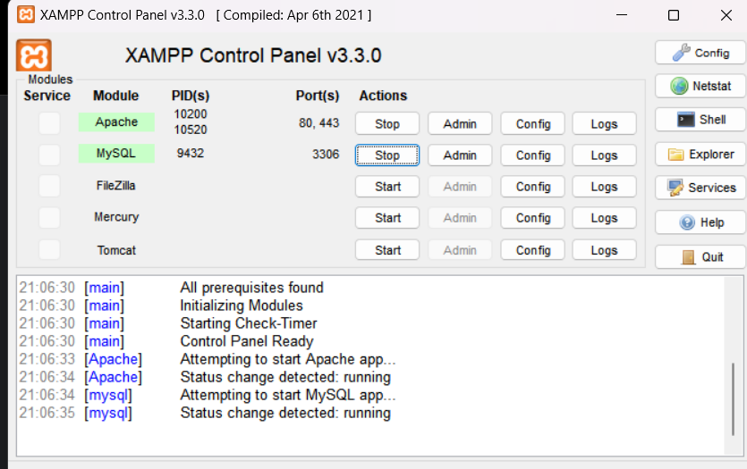
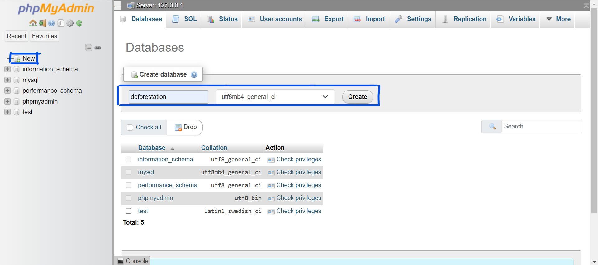

# Deforestation

This blog is dedicated to discussing the problems deforestation is causing in our world and how we can prevent further destruction.

## Contents

- [English](#english)
- [Português](#português)
- [Español](#español)

## English

### Requirements

- [XAMPP](https://www.apachefriends.org/index.html)

### Project setup and execution

<b>Step 1</b>: Install [XAMPP](https://www.apachefriends.org/index.html)

<b>Step 2</b>: Clone the project or download the zip and extract it to `C:/xampp/htdocs` _(Default XAMPP path)_.

<b>Step 3</b>: Start the <u>_APACHE_</u> and <u>_MySQL_</u> servers. It should look like this when both are started.

<b>Step 4</b>: In the <u>_MySQL_</u> admin panel, create a new database named 'deforestation'.

<b>Step 5</b>: Go to http://localhost/deforestation/api/ to run all automatic database configuration.

<b>Step 6</b>: The blog is now available at http://localhost/deforestation/app/views/

## Português

### Requisitos

- [XAMPP](https://www.apachefriends.org/pt_br/index.html)

### Configuração e execução do projeto

<b>Passo 1</b>: Instale o [XAMPP](https://www.apachefriends.org/pt_br/index.html)

<b>Passo 2</b>: Clone o projeto ou baixe o zip e extraia-o em `C:/xampp/htdocs` _(Caminho padrão do XAMPP)_.

<b>Passo 3</b>: Inicie os servidores <u>_APACHE_</u> e <u>_MySQL_</u>. Deve ficar assim quando ambos estiverem iniciados.

<b>Passo 4</b>: No painel de administração do <u>_MySQL_</u>, crie um novo banco de dados chamado 'deforestation'.

<b>Passo 5</b>: Vá para http://localhost/deforestation/api/ para executar toda a configuração automática do banco de dados.

<b>Passo 6</b>: O blog agora está disponível em http://localhost/deforestation/app/views/

## Español

### Requisitos

- [XAMPP](https://www.apachefriends.org/es/index.html)

### Configuración y ejecución del proyecto

<b>Paso 1</b>: Instale [XAMPP](https://www.apachefriends.org/es/index.html)

<b>Paso 2</b>: Clone el proyecto o descargue el zip y extraígalo en `C:/xampp/htdocs` _(Ruta predeterminada de XAMPP)_.

<b>Paso 3</b>: Inicie los servidores <u>_APACHE_</u> y <u>_MySQL_</u>. Debería verse así cuando ambos estén iniciados.

<b>Paso 4</b>: En el panel de administración de <u>_MySQL_</u>, cree una nueva base de datos llamada 'deforestation'.

<b>Paso 5</b>: Vaya a http://localhost/deforestation/api/ para ejecutar toda la configuración automática de la base de datos.

<b>Paso 6</b>: El blog ya está disponible en http://localhost/deforestation/app/views/
